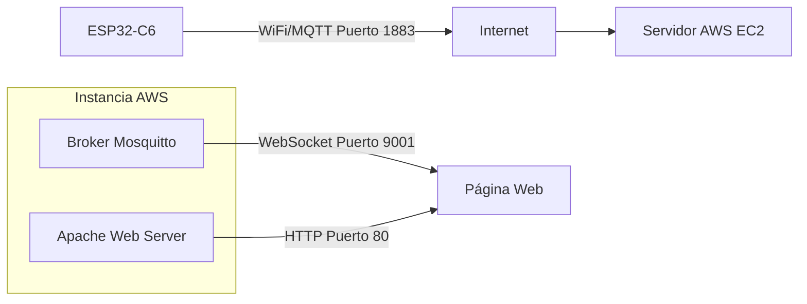
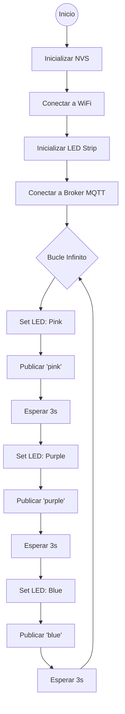

# Aplicación IoT: Control de LED ESP32 con MQTT y Servidor Web

**Curso:** Desarrollo de Sistemas IoT  
**Universidad:** Universidad Nacional de Colombia  
**Autor:** Laura Daniela Alarcón Castaño  
**Plataforma:** ESP-IDF v5.5  
**Fecha:** 12/12/2025  

---

## 1. Resumen del Proyecto

Este repositorio documenta la implementación de un sistema IoT completo que integra hardware embebido y servicios en la nube. Un microcontrolador **ESP32-C6** gestiona un LED RGB interno que cicla entre colores cada 3 segundos. El estado del LED se transmite mediante el protocolo **MQTT** a un servidor **AWS EC2**, permitiendo visualizar el cambio de color en tiempo real a través de una página web mediante WebSockets.

## 2. Componentes y Arquitectura

### Hardware y Software
- **Microcontrolador:** ESP32-C6-DevKitC-1 v1.2 (con LED RGB WS2812).
- **Servidor Cloud:** Instancia AWS EC2 (Ubuntu 22.04 LTS).
- **Broker MQTT:** Eclipse Mosquitto (con soporte para WebSockets).
- **Servidor Web:** Apache HTTP Server.
- **Frontend:** HTML5 + JavaScript (Paho MQTT Client).

### Diagrama de Arquitectura



---

## 3. Implementación del Servidor (AWS EC2)

### 3.1. Configuración de la Instancia
Se creó una cuenta en la consola de AWS y se lanzó una instancia EC2 con las siguientes especificaciones de red para permitir la comunicación IoT:

- **AMI:** Ubuntu Server 22.04 LTS.
- **Puertos de Entrada (Inbound Rules):**
    - `SSH (22)`: Acceso administrativo.
    - `HTTP (80)`: Servidor web Apache.
    - `MQTT (1883)`: Comunicación TCP para el ESP32.
    - `WebSocket (9001)`: Comunicación para el cliente web.

.png)

### 3.2. Conexión y Despliegue de Servicios
Para acceder al servidor, se configuran los permisos de la llave privada (`.pem`) y se establece la conexión SSH:

```bash
chmod 400 key-descargada.pem
ssh -i "esp-webserver.pem" ubuntu@ec2-TU-IP-DNS.us-east-2.compute.amazonaws.com
```

Una vez dentro del servidor, se actualizan los repositorios y se instalan los servicios necesarios:

```bash
# Instalación del servidor web
sudo apt update
sudo apt install apache2

# Creación del directorio para el sitio web
sudo mkdir -p /var/www/html/mi-sitio
# Asignación de permisos (Asegúrese de usar el usuario correcto del sistema)
sudo chown -R ubuntu:ubuntu /var/www/html/mi-sitio
```

### 3.3. Configuración del Broker MQTT (Mosquitto)
Se instala Mosquitto y el cliente de línea de comandos para pruebas:

```bash
sudo apt install mosquitto mosquitto-clients
sudo systemctl enable mosquitto
sudo systemctl start mosquitto
```

> **Nota:** Es necesario configurar el archivo `mosquitto.conf` para habilitar el *listener* en el puerto 9001 con protocolo `websockets` para que la página web pueda conectarse.

Se realizaron pruebas de funcionalidad utilizando dos terminales (una como suscriptor y otra como publicador) para verificar el paso de mensajes.

.png)

---

## 4. Interfaz Web (Frontend)

Para la visualización, se creó un archivo `index.html` servido por Apache. Este cliente utiliza la librería **Paho MQTT** para conectarse vía WebSockets al broker.

**Ruta del archivo:** `/var/www/html/index.html`

```html
<!DOCTYPE html>
<html lang="es">
<head>
  <meta charset="UTF-8">
  <title>Monitor ESP32 LED</title>
  <style>
    body { font-family: 'Segoe UI', Arial, sans-serif; text-align: center; margin-top: 40px; background-color: #f4f4f9; }
    #circle {
      width: 120px; height: 120px; border-radius: 50%;
      background: #222; margin: 0 auto 20px auto;
      box-shadow: 0 4px 15px rgba(0,0,0,0.2); transition: background 0.5s ease;
    }
    #status { margin: 20px 0; font-weight: bold; }
    .connected { color: #28a745; }
    .disconnected { color: #dc3545; }
    .connecting { color: #ffc107; }
  </style>
</head>
<body>
  <h2>Monitor de Estado ESP32</h2>
  <div id="circle"></div>
  <div id="status" class="connecting">Conectando a MQTT...</div>
  <div>Color actual: <span id="colorText">---</span></div>
  <div>Mensajes recibidos: <span id="messageCount">0</span></div>

  <script src="[https://cdnjs.cloudflare.com/ajax/libs/paho-mqtt/1.0.1/mqttws31.min.js](https://cdnjs.cloudflare.com/ajax/libs/paho-mqtt/1.0.1/mqttws31.min.js)"></script>
  <script>
    window.onload = function() {
      // CONFIGURACIÓN: Reemplazar con la IP Pública de la instancia AWS
      const brokerHost = "TU_IP_PUBLICA_AQUI"; 
      const brokerPort = 9001; // Puerto WebSocket
      const topic = "esp32/led";

      const colorMap = {
        pink: "#ff1493",
        purple: "#800080",
        blue: "#0000ff"
      };

      let messageCount = 0;
      // Generar ID de cliente único para evitar desconexiones
      let client = new Paho.MQTT.Client(brokerHost, brokerPort, "web_" + new Date().getTime());

      client.onConnectionLost = function(responseObject) {
        console.log("Conexión perdida: " + responseObject.errorMessage);
        updateStatus("Desconectado", "disconnected");
      };

      client.onMessageArrived = function(message) {
        console.log("Payload: " + message.payloadString);
        const color = message.payloadString.toLowerCase();
        messageCount++;
        
        document.getElementById('colorText').textContent = color;
        document.getElementById('messageCount').textContent = messageCount;
        document.getElementById('circle').style.background = colorMap[color] || "#222";
      };

      const connectOptions = {
        timeout: 10,
        keepAliveInterval: 30,
        onSuccess: function() {
          console.log("Conectado al Broker");
          updateStatus("Conectado a MQTT", "connected");
          client.subscribe(topic);
        },
        onFailure: function(error) {
          console.error("Fallo de conexión", error);
          updateStatus("Error de Conexión", "disconnected");
        }
      };

      function updateStatus(text, className) {
        const el = document.getElementById('status');
        el.textContent = text;
        el.className = className;
      }

      console.log("Iniciando conexión a " + brokerHost);
      client.connect(connectOptions);
    };
  </script>
</body>
</html>
```

La interfaz es accesible vía: `http://TU_IP_PUBLICA/index.html`

.png)

---

## 5. Configuración del Firmware (ESP32-C6)

### 5.1 Requisitos y Estructura
El desarrollo se realizó utilizando **ESP-IDF v5.5** en Visual Studio Code. La estructura del proyecto es estándar:

```
main/
├── CMakeLists.txt           # Configuración de dependencias
├── idf_component.yml        # Dependencia led_strip
├── Kconfig.projbuild        # Configuración del proyecto
└── station_example_main.c   # Código principal
```

### 5.2 Compilación y Flasheo
Utilizando la extensión de Espressif en VS Code (`Ctrl + Shift + P`):

1.  **Seleccionar Puerto:** Puerto COM/TTY donde está conectado el ESP32.
2.  **Seleccionar Target:** `ESP32-C6`.
3.  **Ejecutar:** `ESP-IDF: Build, Flash and Start a Monitor`.

.png)

---

## 6. Resultados y Lógica de Control

### Comportamiento del Sistema
El firmware implementa una máquina de estados sencilla que controla el LED y reporta su estado.

1.  **Monitor Serial:** Muestra la conexión exitosa a WiFi y al Broker MQTT, seguido de logs cada vez que se publica un color.
2.  **Hardware:** El LED RGB en la placa cambia físicamente de color.
3.  **Web:** El círculo en la página web se sincroniza instantáneamente con el LED físico (latencia < 200ms).

### Diagrama de Flujo del Firmware

